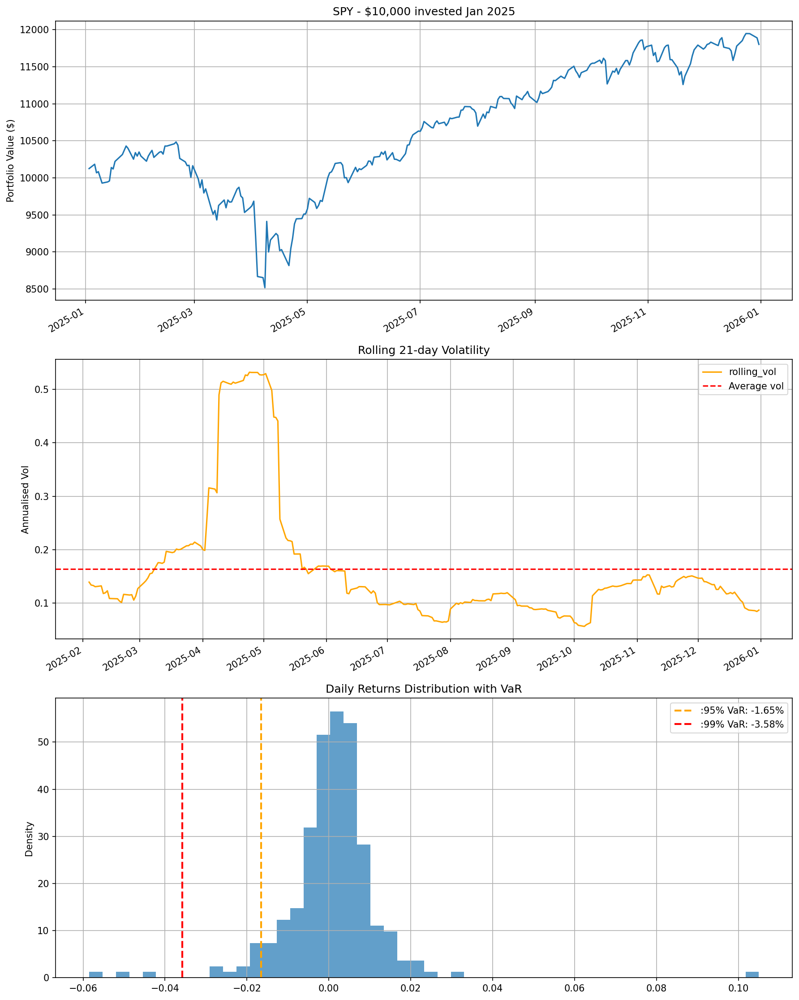
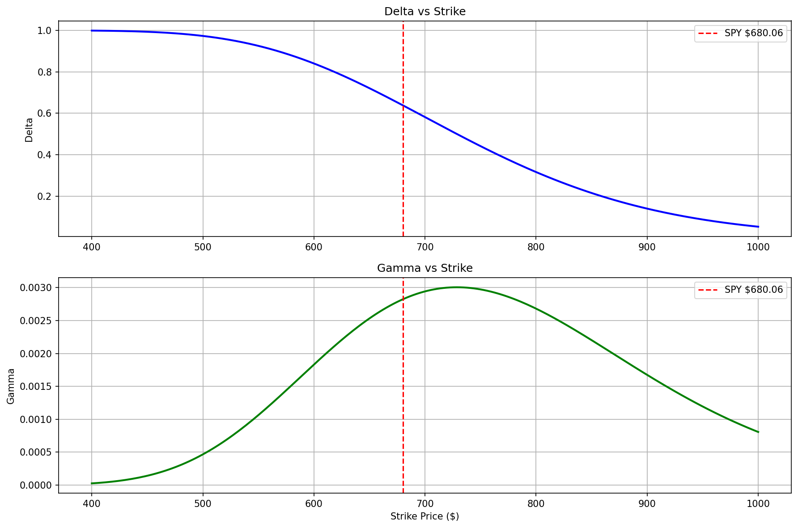

# Quant Journey — Market Analysis Project

## Overview
Hands-on quantitative finance project built in Python as preparation for MQF at SMU Singapore. Covers market risk analysis, derivatives pricing, and options Greeks using real market data.

## Projects

### Week 1 - SPY/STI Market Risk Analysis
- Analysed 250 trading days of SPY and STI ETF data (2025)
- Calculated daily returns, rolling volatility, Sharpe ratio, VaR and CVaR
- Discovered SPY-STI lead-lag relationship: 0.61 lagged correlation vs 0.09 same-day
  - explained by NYSE/SGX timezone difference
- STI outperformed SPY: 29% vs 11% return, Sharpe 1.96 vs 0.63
- Identified April 4/9 tariff war events as largest vol spike of 2025
  (rolling vol peaked at 53% annualised vs 17% average)

### Week 2 - Monte Carlo Options Pricing & Greeks
- Built Monte Carlo pricer using risk-neutral pricing
- Matched Black-Scholes within $0.95 on SPY call option
- Visualised call option payoff: breakeven $758.78, max loss $58.78
- Calculated and plotted Delta and Gamma across strike prices
- Showed Gamma peaks at-the-money - explaining why ATM options are most actively traded and     most expensive to hedge

## Tools
Python, Jupyter, yfinance, pandas, numpy, matplotlib, scipy

## Key Finding
- Real market returns have kurtosis of 23.5 vs Gaussian baseline of 3
  - fat tails are significant and Gaussian risk models underestimate tail risk
- STI resilience during April tariff crash explains its superior risk-adjusted returns vs SPY   in 2025
- Risk-neutral Monte Carlo and Black-Scholes converge to same option price from completely      different mathematical approaches

## Status
Week 1 complete: Market risk analysis
Week 2 complete: Options pricing and Greeks
Week 3 in progress: Backtesting
